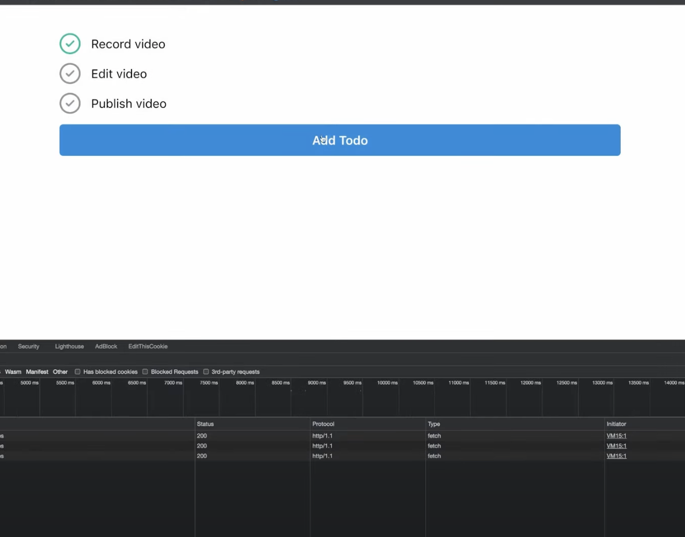
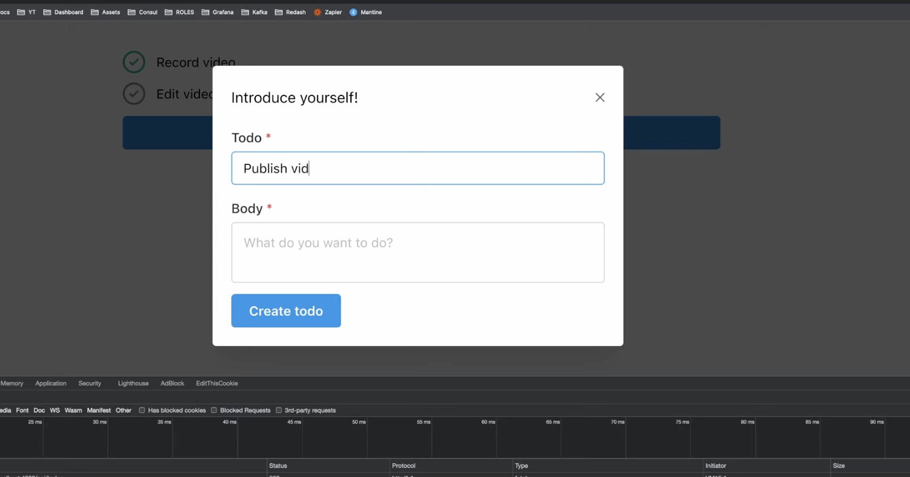
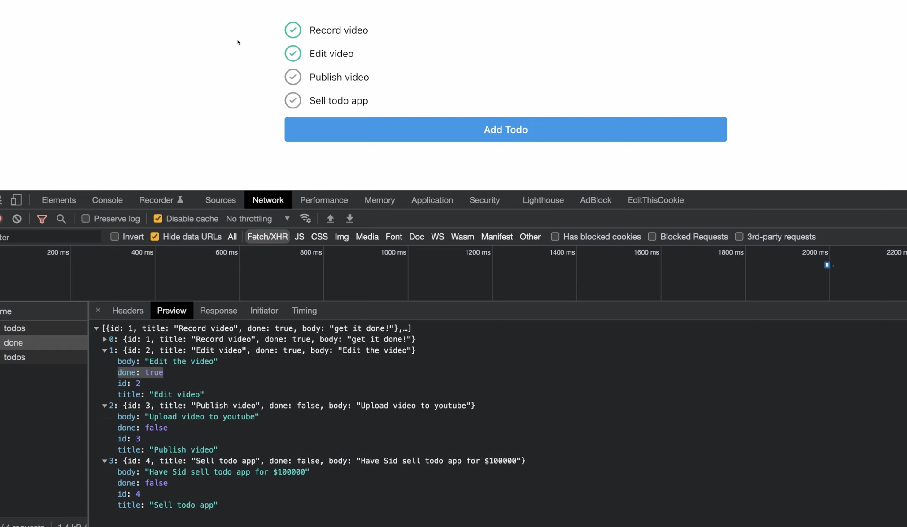

# Build A Go REST API, React.js & TypeScript Todo Application
We will build a simple todo application with a Go server and a React.js front-end bootstrapped with ViteJS.
On the back-end, we will use Go Fibre as the webserver and on the front-end we use TypeScript.

# `Build Todo Application with Go & React`
 Build Todo Application with Go & React

# `What are we using?..`
   1. [Go - Server](https://go.dev/)
   2. [Fiber - Go web server](https://github.com/gofiber/fiber)
   3. [Vite - Client](https://vitejs.dev/)
   4. [Mantine - React component library](https://mantine.dev/)
   5. [TypeScript - Static types](https://www.typescriptlang.org/)

# `Gofiber.. `
    package fiber is an Express inspired web framework built on top of Fasthttp, the fastest HTTP engine for Go.
    Designed to ease things up for fast development with zero memory allocation and performance in mind.
    Fiber is an Express inspired web framework built on top of Fasthttp, the fastest HTTP engine for Go.
    Designed to ease things up for fast development with zero memory allocation and performance in mind.

# `⚙️ Installation.. `
    go get -u github.com/gofiber/fiber/v2

# `What will you learn ..`

    1.  How to make a basic Go REST API
    2.  How to make a todo UI
    3.  React with TypeScript
    3.  Basic Mantine usage

# `ScreenShot`

